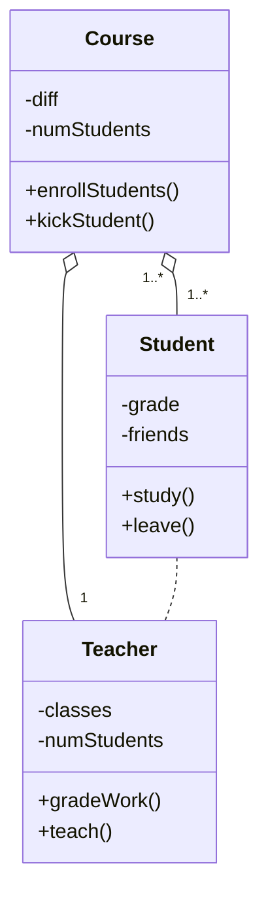

```mermaid
%% Create a UML Class diagram on Umbrello (and export it as school.png) and demonstrate the following:
%%        ◦ Create classes Student, Course, and Teacher
%%        ◦ Add at least two attributes and two methods for each class
%%        ◦ Show appropriate relationships between Students, Courses and Teachers
classDiagram

class Student
Student : -grade
Student : -friends
Student : +study()
Student : +leave()


class Course
Course : -diff
Course : -numStudents
Course : +enrollStudents()
Course : +kickStudent()


class Teacher
Teacher : -classes
Teacher : -numStudents
Teacher : +gradeWork()
Teacher : +teach()

Course o-- "1" Teacher
Course "1..*" o-- "1..*" Student
Student .. Teacher

```
