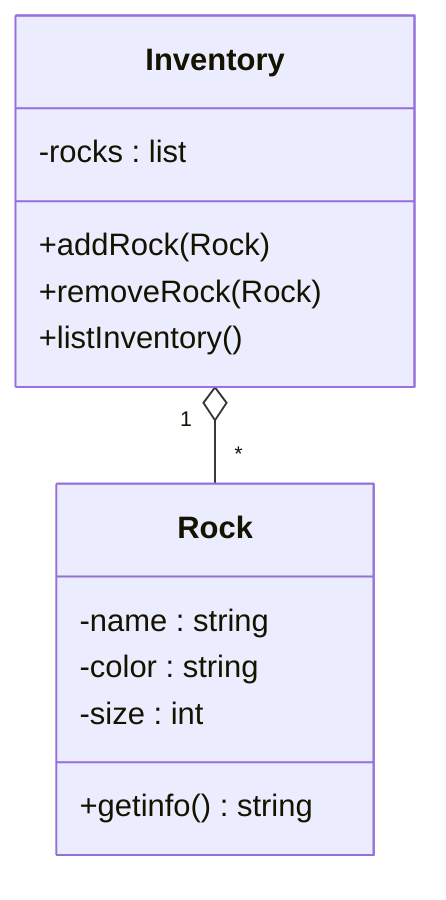

```mermaid
classDiagram

class Inventory {
    -rocks : list
    +addRock(Rock)
    +removeRock(Rock)
    +listInventory()
}


class Rock {
    -name : string
    -color : string
    -size : int
    +getinfo() string
}

Inventory "1" o-- "*" Rock


```
